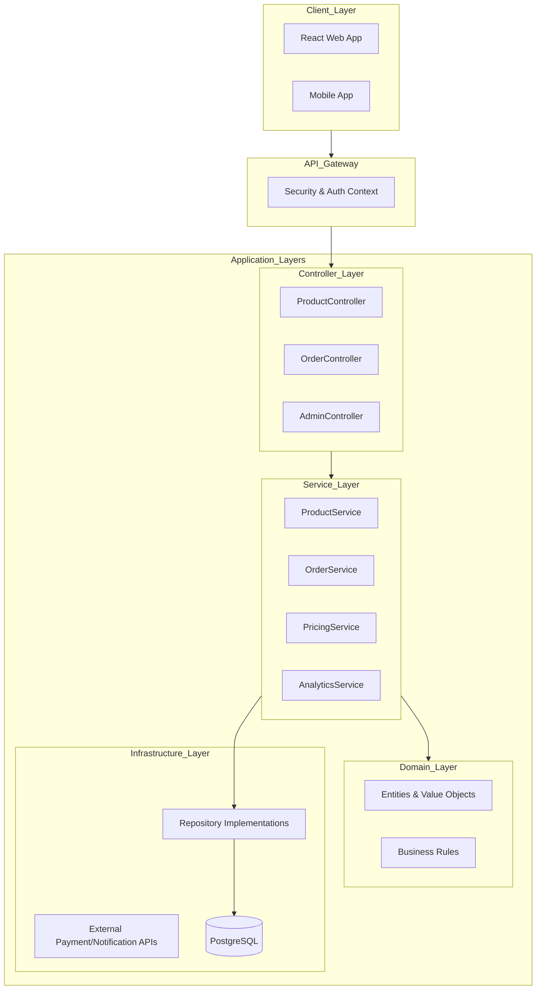
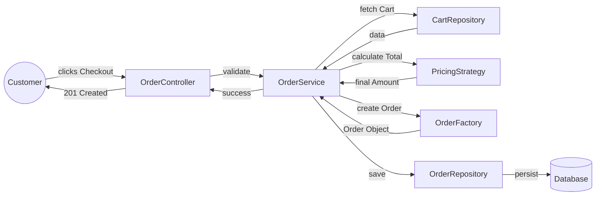

# Kirana Architecture Design

This document outlines the senior-level architecture design for the Kirana platform, focusing on scalability, maintainability, and clean code principles.

## 1. High-Level System Design

Kirana is designed as a **Modular Monolith** to balance simplicity with scalability. It utilizes a **Clean Architecture** (Onion Architecture) approach to ensure that business logic is decoupled from external frameworks and drivers.

### Technology Stack
- **Backend Framework**: Spring Boot (Java) - *Chosen for robust OOP and Dependency Injection support.*
- **Database**: PostgreSQL (Relational) - *For ACID compliance and complex queries.*
- **Cache**: Redis - *For cart management and session persistence.*
- **Authentication**: JWT (JSON Web Tokens) with Spring Security.
- **Reporting**: Asynchronous reporting service using an internal event bus.

---

## 2. Component Diagram



---

## 3. Data Flow Diagram (Checkout Process)



---

## 4. Folder Structure (Clean Architecture)

```text
com.kirana.core
├── api                 # Presentation Layer
│   ├── controller      # REST Controllers
│   ├── dto             # Data Transfer Objects (Request/Response)
│   └── mapper          # DTO to Entity Mappers
├── application         # Application Layer (Use Cases)
│   ├── service         # Business Logic Implementations
│   ├── interfaces      # Repository & External Service Interfaces
│   └── security        # Security Context & Auth Logic
├── domain              # Domain Layer (Enterprise Rules)
│   ├── model           # Pure Domain Entities
│   ├── factory         # Object Factories
│   ├── strategy        # Business Logic Strategies (Pricing)
│   └── exception       # Domain Specific Exceptions
└── infrastructure      # Infrastructure Layer
    ├── persistence     # DB Repositories (JPA/Hibernate)
    ├── external        # External API clients (Payment, Mail)
    └── config          # Framework Specific Configurations
```

---

## 5. OOP Principles Usage

| Principle | Implementation in Kirana |
| :--- | :--- |
| **Encapsulation** | All entity fields are `private`. Data access is strictly through Service methods. DTOs are used to ensure internal models aren't exposed to the API. |
| **Abstraction** | Controllers depend on `Service` interfaces, and Services depend on `Repository` interfaces. This allows switching the implementation (e.g., DB swap) without touching business logic. |
| **Inheritance** | A base `User` class is extended by `Customer` and `Admin`. Common fields like `email`, `password`, and `id` are handled in the parent class. |
| **Polymorphism** | Used in `PricingStrategy`. Different discount logic (e.g., `HolidayDiscount`, `BulkDiscount`) can be used interchangeably via a common interface. |

---

## 6. Design Patterns Usage

### Singleton (Database Connection)
- **Why**: To manage resource usage and ensure all parts of the application use the same database connection pool.
- **Where**: The `DatabaseConfig` or `DataSource` bean in Spring is a Singleton by default.

### Factory (Order Creation)
- **Why**: Orders are complex objects containing multiple items, address details, and calculated totals. A `OrderFactory` encapsulates this creation logic.
- **Where**: `domain.factory.OrderFactory` – transforms a Cart into an Order entity.

### Strategy (Pricing Logic)
- **Why**: Pricing can change based on promotions, customer loyalty, or delivery distance.
- **Where**: `domain.strategy.PricingStrategy` interface, implemented by `FixedPricingStrategy`, `DiscountPricingStrategy`, etc. The `OrderService` picks the right strategy at runtime.
