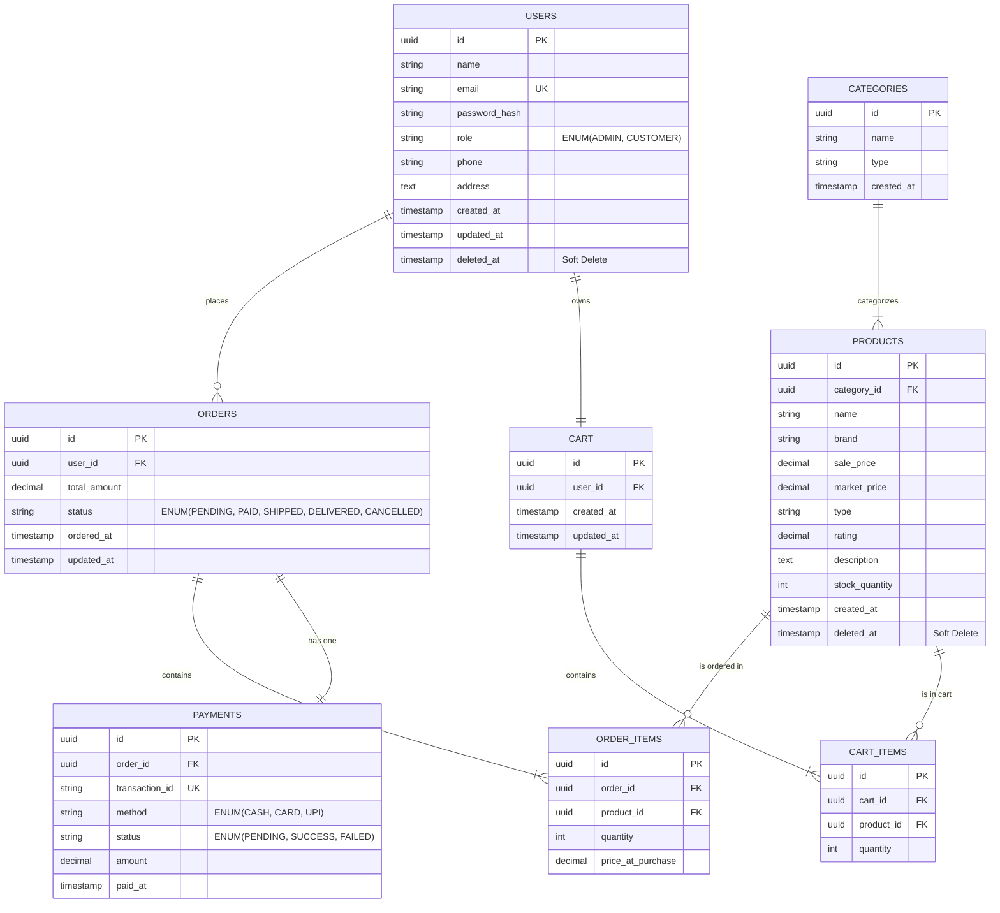

# Kirana Advanced ER Diagram

This diagram represents a normalized, production-grade schema following senior-level architecture principles.

```mermaid
erDiagram
    USERS {
        uuid id PK
        string name
        string email UK
        string password_hash
        string role "ENUM(ADMIN, CUSTOMER)"
        string phone
        text address
        timestamp created_at
        timestamp updated_at
        timestamp deleted_at "Soft Delete"
    }

    PRODUCTS {
        uuid id PK
        uuid category_id FK
        string name
        string brand
        decimal sale_price
        decimal market_price
        string type
        decimal rating
        text description
        int stock_quantity
        timestamp created_at
        timestamp deleted_at "Soft Delete"
    }

    CATEGORIES {
        uuid id PK
        string name
        string type
        timestamp created_at
    }

    ORDERS {
        uuid id PK
        uuid user_id FK
        decimal total_amount
        string status "ENUM(PENDING, PAID, SHIPPED, DELIVERED, CANCELLED)"
        timestamp ordered_at
        timestamp updated_at
    }

    ORDER_ITEMS {
        uuid id PK
        uuid order_id FK
        uuid product_id FK
        int quantity
        decimal price_at_purchase
    }

    CART {
        uuid id PK
        uuid user_id FK
        timestamp created_at
        timestamp updated_at
    }

    CART_ITEMS {
        uuid id PK
        uuid cart_id FK
        uuid product_id FK
        int quantity
    }

    PAYMENTS {
        uuid id PK
        uuid order_id FK
        string transaction_id UK
        string method "ENUM(CASH, CARD, UPI)"
        string status "ENUM(PENDING, SUCCESS, FAILED)"
        decimal amount
        timestamp paid_at
    }

    USERS ||--o{ ORDERS : places
    USERS ||--|| CART : owns
    
    ORDERS ||--|{ ORDER_ITEMS : contains
    CART ||--|{ CART_ITEMS : contains
    ORDERS ||--|| PAYMENTS : "has one"

    PRODUCTS ||--o{ ORDER_ITEMS : "is ordered in"
    PRODUCTS ||--o{ CART_ITEMS : "is in cart"
    
    CATEGORIES ||--|{ PRODUCTS : "categorizes"
```
