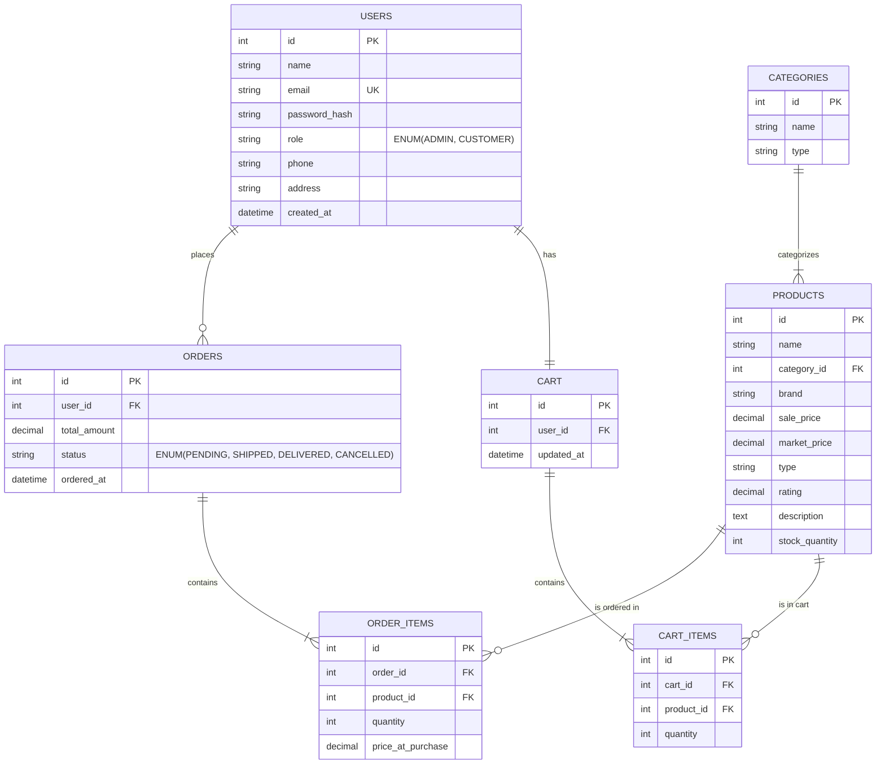

# KiranaConnect ER Diagram

```mermaid
erDiagram
    USERS {
        int id PK
        string name
        string email UK
        string password_hash
        string role "ENUM(ADMIN, CUSTOMER)"
        string phone
        string address
        datetime created_at
    }

    PRODUCTS {
        int id PK
        string name
        int category_id FK
        string brand
        decimal sale_price
        decimal market_price
        string type
        decimal rating
        text description
        int stock_quantity
    }

    CATEGORIES {
        int id PK
        string name
        string type
    }

    ORDERS {
        int id PK
        int user_id FK
        decimal total_amount
        string status "ENUM(PENDING, SHIPPED, DELIVERED, CANCELLED)"
        datetime ordered_at
    }

    ORDER_ITEMS {
        int id PK
        int order_id FK
        int product_id FK
        int quantity
        decimal price_at_purchase
    }

    CART {
        int id PK
        int user_id FK
        datetime updated_at
    }

    CART_ITEMS {
        int id PK
        int cart_id FK
        int product_id FK
        int quantity
    }

    USERS ||--o{ ORDERS : places
    USERS ||--|| CART : has
    
    ORDERS ||--|{ ORDER_ITEMS : contains
    CART ||--|{ CART_ITEMS : contains

    PRODUCTS ||--o{ ORDER_ITEMS : "is ordered in"
    PRODUCTS ||--o{ CART_ITEMS : "is in cart"
    
    CATEGORIES ||--|{ PRODUCTS : "categorizes"
```
