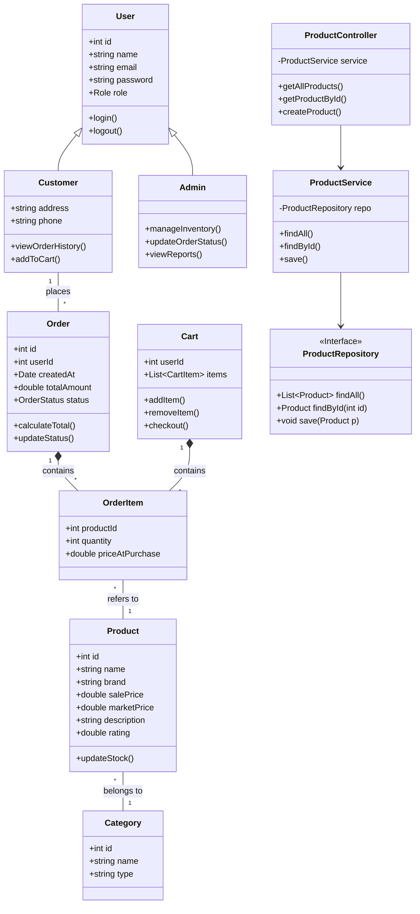

# KiranaConnect Class Diagram

```mermaid
classDiagram
    %% Core Entities
    class User {
        +int id
        +string name
        +string email
        +string password
        +Role role
        +login()
        +logout()
    }

    class Customer {
        +string address
        +string phone
        +viewOrderHistory()
        +addToCart()
    }

    class Admin {
        +manageInventory()
        +updateOrderStatus()
        +viewReports()
    }

    User <|-- Customer
    User <|-- Admin

    class Product {
        +int id
        +string name
        +string brand
        +double salePrice
        +double marketPrice
        +string description
        +double rating
        +updateStock()
    }

    class Category {
        +int id
        +string name
        +string type
    }

    class Order {
        +int id
        +int userId
        +Date createdAt
        +double totalAmount
        +OrderStatus status
        +calculateTotal()
        +updateStatus()
    }

    class OrderItem {
        +int productId
        +int quantity
        +double priceAtPurchase
    }

    class Cart {
        +int userId
        +List~CartItem~ items
        +addItem()
        +removeItem()
        +checkout()
    }

    %% Relationships
    Product "*" -- "1" Category : belongs to
    Order "1" *-- "*" OrderItem : contains
    OrderItem "*" -- "1" Product : refers to
    Customer "1" -- "*" Order : places
    Cart "1" *-- "*" OrderItem : contains

    %% Controller - Service - Repository Layers (Sample for Product)
    class ProductController {
        -ProductService service
        +getAllProducts()
        +getProductById()
        +createProduct()
    }

    class ProductService {
        -ProductRepository repo
        +findAll()
        +findById()
        +save()
    }

    class ProductRepository {
        <<Interface>>
        +List~Product~ findAll()
        +Product findById(int id)
        +void save(Product p)
    }

    ProductController --> ProductService
    ProductService --> ProductRepository
```
