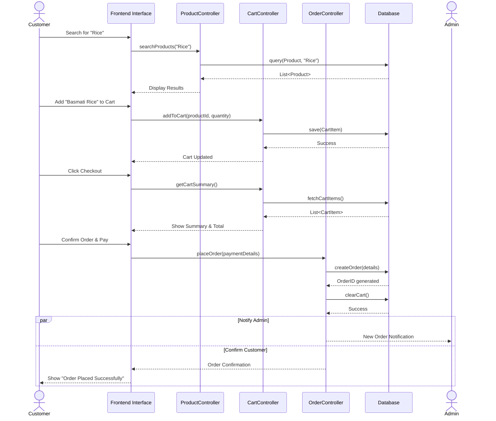

# KiranaConnect Sequence Diagram (Order Flow)

```mermaid
sequenceDiagram
    actor Customer
    participant UI as Frontend Interface
    participant PC as ProductController
    participant CC as CartController
    participant OC as OrderController
    participant DB as Database
    actor Admin

    Customer->>UI: Search for "Rice"
    UI->>PC: searchProducts("Rice")
    PC->>DB: query(Product, "Rice")
    DB-->>PC: List<Product>
    PC-->>UI: Display Results

    Customer->>UI: Add "Basmati Rice" to Cart
    UI->>CC: addToCart(productId, quantity)
    CC->>DB: save(CartItem)
    DB-->>CC: Success
    CC-->>UI: Cart Updated

    Customer->>UI: Click Checkout
    UI->>CC: getCartSummary()
    CC->>DB: fetchCartItems()
    DB-->>CC: List<CartItem>
    CC-->>UI: Show Summary & Total

    Customer->>UI: Confirm Order & Pay
    UI->>OC: placeOrder(paymentDetails)
    OC->>DB: createOrder(details)
    DB-->>OC: OrderID generated
    OC->>DB: clearCart()
    DB-->>OC: Success
    
    par Notify Admin
        OC-->>Admin: New Order Notification
    and Confirm Customer
        OC-->>UI: Order Confirmation
        UI-->>Customer: Show "Order Placed Successfully"
    end
```
