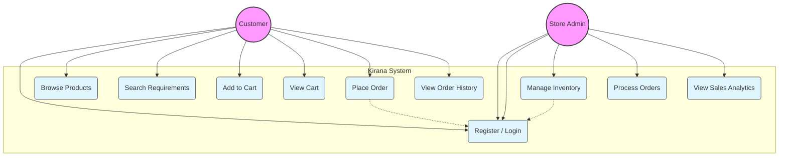

# Kirana Use Case Diagram

> [!NOTE]
> Since standard `usecaseDiagram` syntax was failing to render, this diagram has been converted to the widely compatible `graph` syntax. It represents the same information.

